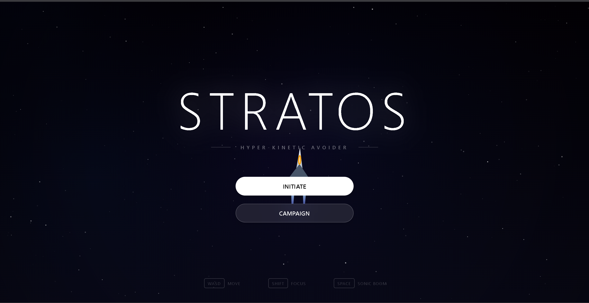
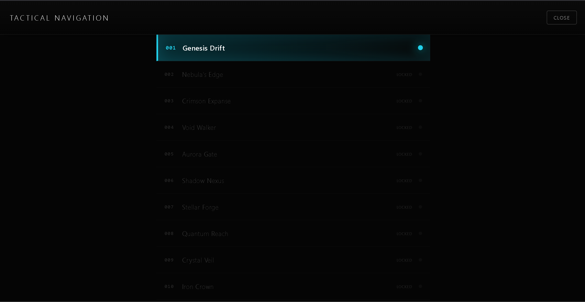
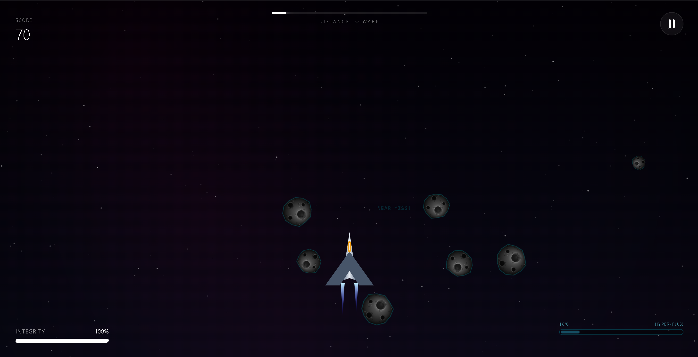

<div align="center">
  <h1>🌌 Stratos</h1>
  <p><strong>A High-Speed, Procedural Sci-Fi Obstacle Avoidance Game</strong></p>

  [](https://react.dev/)
  [](https://vitejs.dev/)
  [](https://capacitorjs.com/)
  [](https://tailwindcss.com/)
  [](https://www.typescriptlang.org/)
  [](https://stratos-opal.vercel.app/)
</div>

<br/>

Stratos is a visually stunning, browser-based endless runner where you pilot an advanced spacecraft through procedurally generated cosmic hazards. Dodge asteroids, navigate nebulas, outmaneuver homing mines, and survive massive laser grids to see how far you can travel into deep space.

---

## 🚀 Live Demo

**Play the game instantly in your browser:**  
🔗 **[https://stratos-opal.vercel.app](https://stratos-opal.vercel.app)**

---

## ✨ Key Features

- **⚡ Procedural Level Generation:** AI-driven level progression via Google Gemini creates infinite, uniquely named sectors with scaling difficulty, speed, and obstacle density.
- **🌠 Parallax Backgrounds & Immersive VFX:** Beautiful multi-layered starry backgrounds, dynamic screen shakes, pulsing thrusters, and shockwaves create a deeply engaging visual experience.
- **🎯 Near-Miss Combo System:** High-risk, high-reward gameplay. Brush closely past asteroids to trigger "NEAR MISS" combos, multiplying your score and keeping adrenaline high.
- **🛸 Dynamic Hazards:** Beyond simple asteroids, survive targeted Homing Mines and massive vertical Laser Beams that force split-second tactical maneuvering.
- **📱 Mobile & Desktop Ready:** Fluid 60 FPS Canvas rendering that plays perfectly via Keyboard, or via responsive touch-controls on mobile devices (via Capacitor).

<br/>

### 📸 Screenshots

| Deep Space Navigation | Warp Sequence | Homing Mine Encounter | Near Miss Mechanics |
| :---: | :---: | :---: | :---: |
|  |  |  |  |

---

## 🛠 Tech Stack

**Frontend & Engine**
- **Framework:** React 19 + Vite
- **Rendering:** HTML5 `<canvas>` via React `useRef` for ultra-fast 60fps draw cycles without DOM overhead
- **Styling & UI:** Tailwind CSS for the HUD, Menus, and overlay components
- **Internationalization:** `i18next` and `react-i18next`

**Procedural Generation & AI**
- **Integration:** Google Gemini GenAI SDK (`@google/genai`) to generate unique mission names, color themes, and obstacle densities dynamically.

**Build & Mobile**
- **Tooling:** Vite, TypeScript
- **Mobile Deployment:** Ionic Capacitor (`@capacitor/core`, `@capacitor/android`)

---

## 🏗 Architecture Overview & "How it Works"

Stratos avoids traditional heavy game engines like Unity or Phaser in favor of a **React + Canvas Architecture**.

1. **The Game Loop:** A single `requestAnimationFrame` loop handles all physics, collision, and rendering independently of React's state cycle, ensuring zero frame drops.
2. **React's Role:** React acts purely as the state manager for the UI Overlay (Health, Score, Combo, Menus), communicating with the Canvas via strict callbacks.
3. **Optimized Rendering:** Particles and objects are pooled using memory-efficient array buffering, and complex shapes (like asteroids) are pre-rendered to an off-screen cache canvas to drastically reduce GPU draw calls.
4. **Adaptive Controls:** The engine automatically detects touch vs. keyboard input, smoothing vector velocities to provide tight, responsive control on any device.

---

## 🚀 Quick Start

1. **Install dependencies:**
   ```bash
   npm install
   ```
2. **Start the development server:**
   ```bash
   npm run dev
   ```
3. Open `http://localhost:3000` to play!

*(Note: Never run `npm install` while the Vite dev server is actively running!)*
